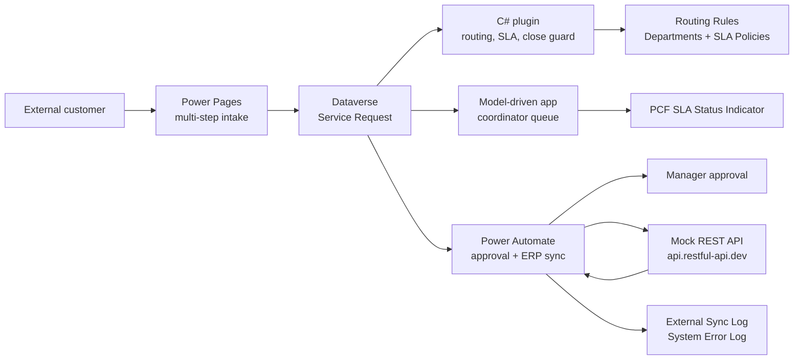
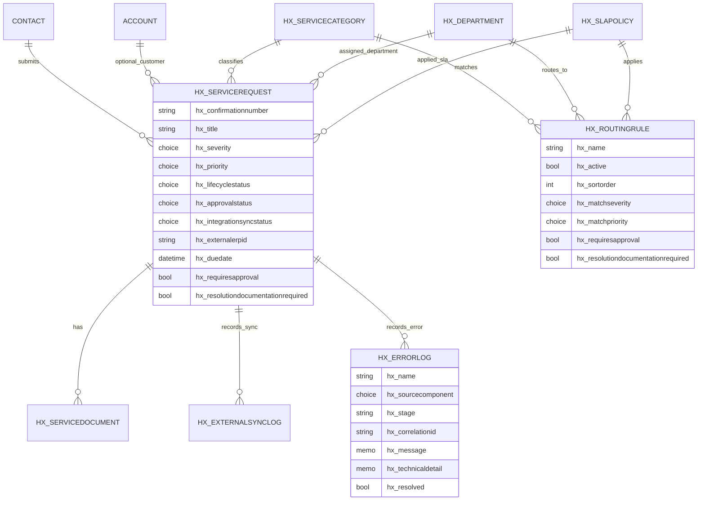

# Enterprise Service Intake

Senior Power Platform Developer take-home assignment for an enterprise external service request intake process.

## Executive Summary

This solution implements authenticated external request intake with Power Pages, Dataverse as the system of record, plugin-based routing and guardrails, Power Automate approval and mock ERP synchronization, and a PCF control for internal coordinator visibility.

End to end: an external user submits a multi-step service request in Power Pages, the C# routing plugin applies configurable department/SLA rules and generates a formatted confirmation number, high-priority requests go through manager approval, approved requests are posted to a mock REST endpoint, the returned external ID is stored in Dataverse, and failures are logged to a custom System Error Log table.

## Reviewer Links

| Area | Link |
| --- | --- |
| Power Platform environment | https://mitacs.crm.dynamics.com/ |
| Maker solution | https://make.powerapps.com/environments/99dd50ed-a753-e37f-912c-78a022b12b09/solutions |
| Model-driven app | https://mitacs.crm.dynamics.com/main.aspx?appid=3de4f813-b454-f111-bec7-000d3a3aca8f |
| Power Pages site | https://enterprise-service-intake-hellox.powerappsportals.com |
| Power Automate flow | `ESI - Approval and ERP Sync` |

The Power Pages site is intentionally private for the interview tenant. Reviewer credentials should be shared separately by the administrator, not committed in this repository.

## Solution Contents

| Deliverable | Location |
| --- | --- |
| Managed solution | `solution/export/Enterprise_ServiceIntake_ForrestZhang_managed.zip` |
| Unmanaged solution | `solution/export/Enterprise_ServiceIntake_ForrestZhang_unmanaged.zip` |
| Unpacked managed source | `solution/unpacked/managed/` |
| Unpacked unmanaged source | `solution/unpacked/unmanaged/` |
| C# plugins | `src/plugins/ServiceIntake.Plugins/` |
| PCF control | `src/pcf/SlaStatusIndicator/` |
| Power Pages source | `src/powerpages/` and `powerpages-live/` |
| Provisioning/ALM utilities | `src/scripts/ServiceIntake.Provisioning/` |
| Architecture design brief | `docs/submission/Enterprise_ServiceIntake_Architecture_Design_ForrestZhang.docx` and `docs/submission/Enterprise_ServiceIntake_Architecture_Design_ForrestZhang.pdf` |
| Submission email draft | `docs/submission/email-draft.md` |
| Demo script | `docs/demo/demo-script.md` |

## Architecture



## ERD



## Key Design Choices

| Requirement | Implementation | Rationale |
| --- | --- | --- |
| Dynamic routing/SLA | Dataverse routing rules evaluated by `ServiceRequestRoutingPlugin` on create/update. | Routing must be transactional and consistent for portal, app, and automation creates. |
| Confirmation number | Dataverse autonumber `SR-{yyyyMMdd}-{SEQNUM}` on Service Request. | Server-generated and tamper-resistant. |
| Critical close guardrail | PreOperation C# plugin blocks resolved/closed critical requests without resolution notes and documentation flag. | A plugin is the right layer because agents cannot bypass it from forms, imports, flows, or API calls. |
| Approval + ERP sync | Cloud flow `ESI - Approval and ERP Sync` with Try scope, approval, HTTP POST, Dataverse writeback, sync log, reject branch, and Catch error-log scope. | Flow is appropriate for human approvals, connector-based integration, retries, and run history evidence. |
| Mock ERP endpoint | `https://api.restful-api.dev/objects` returns an external `id` from POST. | `reqres.in` currently requires an API key for POST, so this endpoint keeps the demo self-contained. |
| Internal UX | Model-driven coordinator app plus PCF SLA/status indicator. | Keeps operational work in Dataverse while using PCF for richer visual status. |
| External UX | Power Pages private site with multi-step intake, upload step, and dynamic SLA/routing preview. | External users get a clean customer-facing experience without internal fields. |

## Security Strategy

- External users authenticate to Power Pages and are associated to Contact rows.
- Power Pages table permissions allow create for intake tables, contact-scoped access for request ownership, and `Append`/`Append To` relationship privileges for request-document linking.
- Public read access is limited to reference/routing data required for SLA preview.
- Internal-only fields such as `hx_internalresolutionnotes` are not exposed on portal pages and the column is configured as secured metadata.
- Internal users work from the model-driven app with Dataverse security roles and views; sensitive audit/error tables are intended for managers/admins.
- Secrets and reviewer passwords are stored outside Git. See the administrator handoff for credential sharing.

## Automation Design

Cloud flow: `ESI - Approval and ERP Sync`

Trigger:

- Dataverse `When a row is added, modified or deleted`
- Table: `Service Requests`
- Change type: `Added or Modified`
- Filter: `hx_requiresapproval eq true and hx_approvalstatus eq 752630001 and hx_integrationsyncstatus eq 752630000`

Main path:

1. `Try - approval and ERP sync` scope.
2. Start and wait for approval assigned to `manager@hellosmart.ca`.
3. If approved, POST to mock ERP endpoint.
4. Update Service Request with approval status, lifecycle, integration status, customer-visible update, and external ERP ID.
5. Create External Sync Log.
6. If rejected, update the request to rejected and skip ERP sync.

Catch path:

- `Catch - log automation error` runs after failed/skipped/timed out Try scope.
- Creates a System Error Log with run correlation ID and failed scope result.
- Marks the request integration/approval state as failed.

## Pro-Code Components

| Component | Location | Purpose |
| --- | --- | --- |
| `ServiceRequestRoutingPlugin` | `src/plugins/ServiceIntake.Plugins/ServiceRequestRoutingPlugin.cs` | Applies routing rule, SLA due date, approval requirement, documentation requirement, and lifecycle defaults. |
| `ServiceRequestClosureGuardPlugin` | `src/plugins/ServiceIntake.Plugins/ServiceRequestClosureGuardPlugin.cs` | Blocks critical request closure without resolution documentation. |
| `SlaStatusIndicator` PCF | `src/pcf/SlaStatusIndicator/` | Visual severity/SLA/approval status indicator for internal coordinators. |
| Provisioning utility | `src/scripts/ServiceIntake.Provisioning/` | Reproducible environment setup, metadata creation, plugin registration, app/forms/views, sample data, and flow definition patching. |

## Demo Data

Seed records include:

- `Demo - Critical funding agreement support` -> Finance, 4 hour SLA, manager approval required.
- `Demo - Standard technical support` -> IT Support, 24 hour SLA, approval not required.
- Portal demo submissions with formatted confirmation numbers such as `SR-20260521-001004`.

Routing rules include critical funding, high research support, standard technical support, standard event support, and a general fallback.

## Verification

Validated locally and against the live environment:

- Plugin build succeeds.
- PCF build and `pac pcf push` succeed.
- Provisioning utility builds and runs.
- Closure guard smoke test blocks undocumented critical closure and allows documented closure.
- Power Pages dynamic preview updates before submit.
- Power Pages create path submits to Dataverse and routes to Finance for critical funding requests.
- Model-driven app opens the coordinator queue and request form.
- Managed/unmanaged solution export and unpack succeed.
- Cloud flow is active, solution-aware, and includes approval, HTTP sync, reject branch, External Sync Log, and Catch error-log scope.

Known warning:

- `Microsoft.PowerPlatform.Dataverse.Client` currently brings transitive `System.Security.Cryptography.Xml` 8.0.2 vulnerability warnings during build. This is from the upstream SDK dependency in the provisioning utility, not custom runtime plugin code.

## Build And Export Commands

```bash
export DOTNET_ROOT="$HOME/.dotnet"
export PATH="$HOME/.dotnet:$HOME/.dotnet/tools:$PATH"

dotnet build src/plugins/ServiceIntake.Plugins/ServiceIntake.Plugins.csproj
dotnet build src/scripts/ServiceIntake.Provisioning/ServiceIntake.Provisioning.csproj

pac solution publish
pac solution export --name EnterpriseServiceIntake --path solution/export/Enterprise_ServiceIntake_ForrestZhang_unmanaged.zip --overwrite
pac solution export --name EnterpriseServiceIntake --path solution/export/Enterprise_ServiceIntake_ForrestZhang_managed.zip --managed --overwrite

pac solution unpack --zipfile solution/export/Enterprise_ServiceIntake_ForrestZhang_managed.zip --folder solution/unpacked/managed --packagetype Managed --clobber --allowWrite
pac solution unpack --zipfile solution/export/Enterprise_ServiceIntake_ForrestZhang_unmanaged.zip --folder solution/unpacked/unmanaged --packagetype Unmanaged --clobber --allowWrite
```

## Reviewer Accounts

| Account | Purpose |
| --- | --- |
| `forrest@hellosmart.ca` | Admin/reviewer |
| `agent@hellosmart.ca` | Internal service coordinator |
| `manager@hellosmart.ca` | Approval manager |

Passwords are intentionally not stored in Git. The system administrator should share them out of band and rotate them after the interview.
