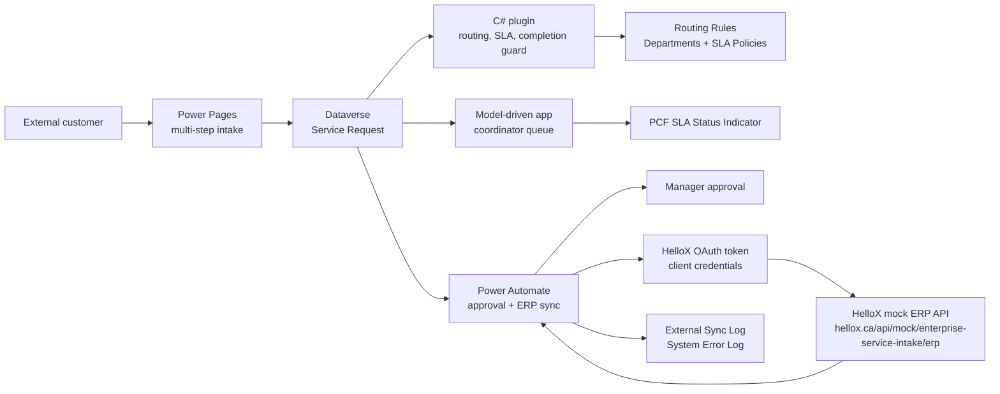
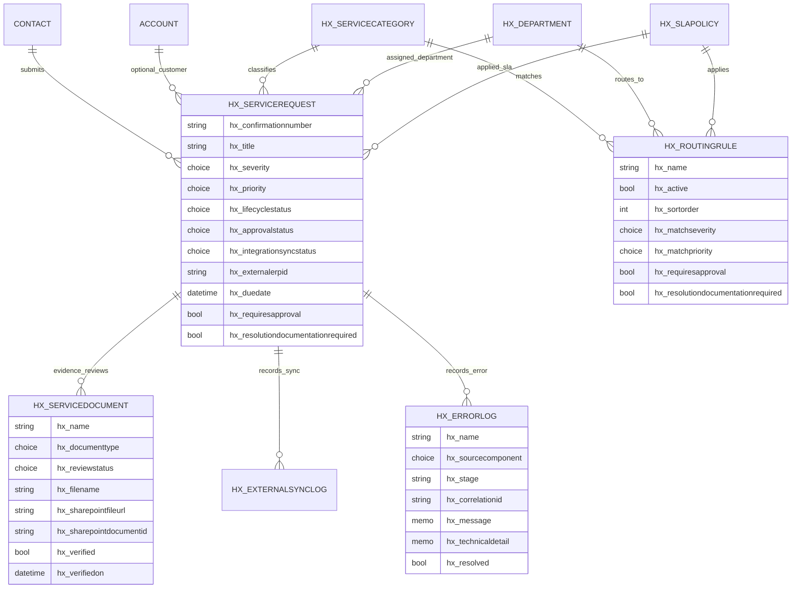

# Enterprise Service Intake

Senior Power Platform Developer take-home assignment for an enterprise external service request intake process.

## Revision History

| Version | Date | Notes |
| --- | --- | --- |
| V4 | 2026-05-22 | Documents authenticated portal decision versus allowed anonymous fallback; refreshes Architecture Design v4 and User Manual v2 artifacts. |
| V3 | 2026-05-22 | Updates for required-document portal workflow, `My requests`, model-driven app navigation groups, editable Routing Matrix web resource, consolidated Service Request form, evidence review terminology, and live verification. |
| V2 | 2026-05-21 | Added confirmation email flow, SharePoint document-management path, Evidence Review metadata, dashboards, and security hardening notes. |
| V1 | 2026-05-20 | Initial architecture, Dataverse model, plugin, PCF, flow, and portal design. |

## Executive Summary

This solution implements authenticated external request intake with Power Pages, Dataverse as the system of record, plugin-based routing and guardrails, Power Automate approval and mock ERP synchronization, and a PCF control for internal coordinator visibility.

End to end: an external user starts a multi-step service request in Power Pages, can save a draft and resume it from `My requests`, uploads required supporting files before final submission when the matched rule requires documentation, and submits the request. The C# routing plugin applies configurable department/SLA rules and generates a formatted confirmation number, high-priority requests go through manager approval, approved requests are posted to a mock REST endpoint, the returned external ID is stored in Dataverse, and failures are logged to a custom System Error Log table.

## Reviewer Links

| Area | Link |
| --- | --- |
| Power Platform environment | https://mitacs.crm.dynamics.com/ |
| Maker solution | https://make.powerapps.com/environments/99dd50ed-a753-e37f-912c-78a022b12b09/solutions |
| Model-driven app | https://mitacs.crm.dynamics.com/main.aspx?appid=3de4f813-b454-f111-bec7-000d3a3aca8f |
| Power Pages site | https://enterprise-service-intake-hellox.powerappsportals.com |
| HelloX mock ERP API | https://hellox.ca/api/mock/enterprise-service-intake/erp |
| HelloX OAuth token endpoint | https://hellox.ca/api/mock/oauth/token |
| Hidden HelloX ERP console | https://hellox.ca/esi/ - view mock ERP sync attempts, returned external IDs, and failure-path evidence |
| Power Automate flow | `ESI - Approval and ERP Sync` |

The Power Pages site is intentionally private for the interview tenant. Reviewer credentials should be shared separately by the administrator, not committed in this repository.

## Solution Contents

| Deliverable | Location |
| --- | --- |
| Managed solution | `solution/export/Enterprise_ServiceIntake_ForrestZhang_managed.zip` |
| Unmanaged solution | `solution/export/Enterprise_ServiceIntake_ForrestZhang_unmanaged.zip` |
| Unpacked managed source | `solution/unpacked/managed/` |
| Unpacked unmanaged source | `solution/unpacked/unmanaged/` |
| C# plugins | `src/plugins/ServiceIntake.Plugins/` |
| PCF control | `src/pcf/SlaStatusIndicator/` |
| Power Pages source | `src/powerpages/` and `powerpages-live/` |
| Provisioning/ALM utilities | `src/scripts/ServiceIntake.Provisioning/` and `tools/apply_model_driven_app_design.mjs` |
| Architecture design brief | `docs/submission/Enterprise_ServiceIntake_Architecture_Design_ForrestZhang_v4.docx` and `docs/submission/Enterprise_ServiceIntake_Architecture_Design_ForrestZhang_v4.pdf` |
| User manual | `docs/manual/user-manual.md`, `docs/submission/Enterprise_ServiceIntake_User_Manual_ForrestZhang_v2.docx`, and `docs/submission/Enterprise_ServiceIntake_User_Manual_ForrestZhang_v2.pdf` |
| Submission email draft | `docs/submission/email-draft.md` |
| Demo script | `docs/demo/demo-script.md` |

## Architecture



## ERD



## Key Design Choices

| Requirement | Implementation | Rationale |
| --- | --- | --- |
| Dynamic routing/SLA | Dataverse stores an 80-row exact-match routing matrix covering every service category, impact level, and urgency combination, plus one documented generic fallback rule for misconfiguration. The portal previews the same active rule rows through Power Pages Web API, and `ServiceRequestRoutingPlugin` applies the exact match or fallback on create/update. See `docs/strategy/routing-rule-matrix.md`. | Routing must be transactional and consistent for portal, app, and automation creates. A complete matrix avoids hidden frontend thresholds, and the fallback prevents unrouted requests if an admin accidentally deactivates a matrix cell. |
| Confirmation number | Dataverse autonumber `SR-{yyyyMMdd}-{SEQNUM}` on Service Request. | Server-generated and tamper-resistant. |
| Critical completion and protected-field guardrail | PreOperation C# plugin blocks resolved/completed critical requests unless internal resolution notes exist and an accepted `Service Request Evidence Review` row references a SharePoint file. The coordinator form locks `Lifecycle Status`, and source-controlled command buttons provide `Resolve Request` and `Complete Request` actions for the two manual lifecycle changes. The same plugin step also blocks non-internal callers from updating approval, ERP sync, routing, SLA, lifecycle, and internal documentation fields. | A plugin is the right layer because agents and API callers cannot bypass it from forms, imports, flows, or portal/Web API calls. The guardrail does not rely on a user-editable documentation checkbox, and the command buttons make the internal UX clearer than direct status editing. |
| Supporting documents | The portal creates or updates a Draft request before the Files step when the matched rule requires documentation, embeds the request-specific secure upload page, and disables Review until at least one file exists. Optional files can still be uploaded after submission. Uploaded files are stored against the request's native SharePoint document location and viewed from the out-of-box model-driven Documents associated tab. `Service Request Evidence Review` stores Dataverse-owned review metadata and file links only for documents that become official evidence. | SharePoint document management needs a saved request ID before files can be associated to the correct Dataverse record. This keeps file storage on the supported document-management path while Dataverse owns request state, routing, approval, and evidence-review decisions. |
| Approval + ERP sync | Cloud flow `ESI - Approval and ERP Sync` with Try scope, approval, OAuth client-credentials token request, protected HTTP POST, Dataverse writeback, sync log, reject branch, and Catch error-log scope. | Flow is appropriate for human approvals, connector-based integration, retries, and run history evidence. The mock ERP token step demonstrates app-to-app authentication without a human refresh token. |
| Applicant confirmation email | Cloud flow `ESI - Send Confirmation Email` triggers when a Service Request reaches Submitted, sends the generated confirmation number to the applicant, and logs email failures to System Error Logs. | Email delivery belongs in automation so failures are visible in flow history/error logs and do not block transactional request creation. Triggering on Submitted prevents draft saves from sending premature confirmation emails. |
| Mock ERP endpoint | `https://hellox.ca/api/mock/enterprise-service-intake/erp` is protected by HelloX OAuth 2.0 client credentials and returns a deterministic external `id`/`externalId` from POST. | Keeps the demo self-contained on a controlled HelloX endpoint, avoids third-party API keys, and provides a deliberate failure mode for the Catch path. The client secret is stored outside Git and injected into the live flow through the provisioning utility. |
| Internal UX | Model-driven coordinator app, PCF SLA/status indicator, grouped navigation, and an editable Routing Matrix web resource. | Keeps operational work in Dataverse while using PCF and a focused web resource for richer visual status and safer rule maintenance. |
| External UX | Power Pages private site with multi-step intake, `My requests`, save-for-later drafts, dynamic SLA/routing preview, and secure SharePoint upload for required or optional files. | External users get a clean customer-facing experience without internal fields. |

## Model-Driven App Design

The `Enterprise Service Intake` app uses solution-aware system forms and views for each included table:

- Navigation groups: `Intake Work`, `Routing Configuration`, and `Monitoring`, each with purpose-specific icons so reviewers do not need to hunt through raw tables.
- Request operations: `Active Service Requests`, `Pending Manager Approval`, `Critical Documentation Guardrails`, and `ERP Sync Monitor`.
- Supporting documentation: Service Request files are available from the coordinator form's `Documents` tab through the SharePoint Documents grid, with a separate `SR Evidence Reviews` subgrid for accepted/rejected evidence metadata.
- Configuration: `Routing Matrix`, `Active Departments`, `Active SLA Policies`, and `Active Service Categories`. The `Routing Matrix` web resource presents one editable category matrix at a time, uses switch controls for manager review/documentation booleans, saves inline with `Xrm.WebApi`, and lets admins open the underlying `Routing / SLA Rule` row from the rule name.
- Monitoring: `ERP Sync Attempts`, `Open Integration and Automation Errors`, and `All System Error Logs`; default Active, Associated, and Lookup views for sync/error logs show request, status, source, correlation, and timing fields.

Dashboards are also provisioned for the live review:

- `ESI - Coordinator Operations Dashboard` shows department load, severity mix, lifecycle mix, coordinator queue, and critical documentation queue.
- `ESI - Manager Approval Dashboard` shows pending approvals, approval outcomes, pending severity, and documentation risk.
- `ESI - Integration Monitoring Dashboard` shows ERP sync status, sync attempts by day, open errors, and recent sync attempts.

The forms are role-focused instead of generic Dataverse layouts: service requests separate intake, triage, routing/SLA, approval/ERP sync, and resolution guardrails; configuration tables surface active rule inputs; log tables prioritize triage fields and payload details.

There are two Service Request main forms by design, but only `Service Request - Coordinator` is included in the internal model-driven app. It includes a `Documents` tab with the actual SharePoint Documents grid plus `SR Evidence Reviews`. `Service Request - SharePoint Documents` remains a minimal Power Pages support form used by the `ESI - Service Request SharePoint Documents` Basic Form to render Dataverse document management after a portal submission; it uses the same SharePoint Documents target but is not included in the coordinator app.

## Security Strategy

- External users authenticate to Power Pages and are associated to Contact rows.
- Anonymous create was considered because the FAQ allows it, but the implemented solution intentionally requires sign-in. Authenticated access better satisfies the primary business scenario, supports `My requests`, draft resume, request-specific file ownership, and contact-scoped table permissions.
- Local Power Pages sign-in is configured to use email address instead of username, with unique email validation enabled so registration does not ask users to manage a separate username.
- Power Pages table permissions allow authenticated global create for Service Request intake and contact-scoped own-record access. Contact-scoped Service Request write is enabled only to support the native SharePoint document upload grid; protected routing, approval, sync, lifecycle, and internal-note fields are still hidden from the portal and rejected by the guard plugin for non-internal callers.
- Power Pages Web API site settings use explicit field allowlists for Service Request, Service Category, Routing Rule, Department, and SLA Policy; `Webapi/error/innererror` is disabled.
- Public read access is limited to reference/routing data required for SLA preview.
- Internal-only fields such as `hx_internalresolutionnotes` are not exposed on portal pages, the column is configured as secured metadata, and the plugin rejects protected-field updates from callers outside the configured internal allowlist.
- Internal users work from the model-driven app with Dataverse security roles and views. `Basic User` is assigned to the internal test users for model-driven app platform and metadata access. `ESI Service Coordinator` is assigned to `agent@hellosmart.ca` for request/evidence read-write work. `ESI Approval Manager` is assigned to `manager@hellosmart.ca` for request/evidence/log review without create/write privileges on Service Requests or Evidence Reviews through that role.
- Secrets and reviewer passwords are stored outside Git. The HelloX mock ERP OAuth client secret is injected from the private provisioning environment file, and the token action uses secure inputs/outputs in Power Automate run history. See the administrator handoff for credential sharing.

## Automation Design

Cloud flow: `ESI - Approval and ERP Sync`

Trigger:

- Dataverse `When a row is added, modified or deleted`
- Table: `Service Requests`
- Change type: `Added or Modified`
- Filter: `hx_requiresapproval eq true and hx_approvalstatus eq 752630001 and hx_integrationsyncstatus eq 752630000`

Main path:

1. `Try - approval and ERP sync` scope.
2. Start and wait for approval assigned to `manager@hellosmart.ca`.
3. If approved, request a short-lived HelloX OAuth access token with the client-credentials grant.
4. POST to the OAuth-protected mock ERP endpoint with `Authorization: Bearer <access_token>`.
5. Update Service Request with approval status, lifecycle, integration status, customer-visible update, and external ERP ID.
6. Create External Sync Log.
7. If rejected, update the request to rejected and skip ERP sync.

Catch path:

- `Catch - log automation error` runs after failed/skipped/timed out Try scope.
- Creates a System Error Log with run correlation ID and failed scope result.
- Marks the request integration/approval state as failed.

Cloud flow: `ESI - Send Confirmation Email`

Trigger:

- Dataverse `When a row is added, modified or deleted`
- Table: `Service Requests`
- Change type: `Added or Modified`
- Filter: submitted lifecycle status

Main path:

1. `Try - send confirmation email` scope.
2. Validate that the request has an applicant Contact and that the Contact has an email address.
3. Send a concise HTML confirmation message through Office 365 Outlook `Send an email (V2)`.
4. Include the generated confirmation number, request title, and submission timestamp in the email body.
5. Update the request customer-visible notes to confirm the applicant email was sent.

Catch/skip path:

- Missing applicant or email address writes a System Error Log instead of failing silently.
- Send failures write a System Error Log with the failed scope result for demo evidence and support triage.

## Pro-Code Components

| Component | Location | Purpose |
| --- | --- | --- |
| `ServiceRequestRoutingPlugin` | `src/plugins/ServiceIntake.Plugins/ServiceRequestRoutingPlugin.cs` | Applies routing rule, SLA due date, approval requirement, documentation requirement, and lifecycle defaults. |
| `ServiceRequestClosureGuardPlugin` | `src/plugins/ServiceIntake.Plugins/ServiceRequestClosureGuardPlugin.cs` | Blocks critical request completion without resolution documentation and rejects external updates to protected internal Service Request fields. |
| `ServiceRequestExternalUpdatePolicy` | `src/plugins/ServiceIntake.Plugins/ServiceRequestExternalUpdatePolicy.cs` | Testable policy for protected-field detection and internal caller allowlists. |
| `SlaStatusIndicator` PCF | `src/pcf/SlaStatusIndicator/` | Visual severity/SLA/approval status indicator for internal coordinators. |
| Provisioning utility | `src/scripts/ServiceIntake.Provisioning/` | Reproducible environment setup, metadata creation, plugin registration, app/forms/views, sample data, and flow definition patching. |

## Demo Data

Seed records include:

- `Demo - Critical funding agreement support` -> Finance, 4 hour SLA, manager approval required.
- `Demo - Standard technical support` -> IT Support, 24 hour SLA, approval not required.
- `Demo - Approved research partnership synced` -> approved, synced to HelloX mock ERP, and populated with external ERP ID.
- `Demo - Rejected research exception` -> rejected approval path.
- `Demo - Approved funding ERP sync failure` -> failed sync path with System Error Log.
- `Demo - Event support in progress` -> no-approval coordinator work item.
- Service Request Evidence Reviews, External Sync Logs, and System Error Logs are seeded so all model-driven tables and dashboards have demo rows.
- Portal demo submissions with formatted confirmation numbers such as `SR-20260521-001004`.

Routing rules include the full category/impact/urgency matrix and the documented `Generic fallback - unmatched request` rule.

## Verification

Validated locally and against the live environment:

- Plugin build succeeds.
- PCF build and `pac pcf push` succeed.
- Provisioning utility builds and runs.
- Completion guard smoke test blocks undocumented critical completion and allows completion only after accepted resolution evidence is recorded.
- Power Pages dynamic preview updates before submit.
- Power Pages create path submits to Dataverse and routes to Finance for critical funding requests.
- Power Pages save-for-later, `My requests`, and required-document gates are present in live source and verified against the downloaded site.
- Model-driven app opens the coordinator queue and request form.
- Model-driven app navigation uses the three reviewed groups and the `Routing Matrix` web resource for rule maintenance.
- Routing Matrix loads the 80-row active matrix, displays a focused category view, saves inline edits, and opens the source rule record when needed.
- Managed/unmanaged solution export and unpack succeed.
- Cloud flow is active, solution-aware, and includes approval, HelloX OAuth token request, Bearer-token sync to HelloX mock ERP, reject branch, External Sync Log, and Catch error-log scope.
- Confirmation email flow is active and solution-aware; email delivery issues are captured in System Error Logs.
- Provisioning utility pins `System.Security.Cryptography.Xml` directly to avoid the vulnerable transitive SDK version reported by NuGet audit.
- PCF control is included in the solution and bound on the Service Request coordinator form.

## Build And Export Commands

```bash
export DOTNET_ROOT="$HOME/.dotnet"
export PATH="$HOME/.dotnet:$HOME/.dotnet/tools:$PATH"

dotnet build src/plugins/ServiceIntake.Plugins/ServiceIntake.Plugins.csproj
dotnet build src/scripts/ServiceIntake.Provisioning/ServiceIntake.Provisioning.csproj
dotnet run --project src/tests/ServiceIntake.PluginPolicy.Tests/ServiceIntake.PluginPolicy.Tests.csproj

REGISTER_PLUGINS_ONLY=true dotnet run --project src/scripts/ServiceIntake.Provisioning/ServiceIntake.Provisioning.csproj
VERIFY_SECURITY_HARDENING=true dotnet run --project src/scripts/ServiceIntake.Provisioning/ServiceIntake.Provisioning.csproj
PATCH_FLOW_DEFINITION=true dotnet run --project src/scripts/ServiceIntake.Provisioning/ServiceIntake.Provisioning.csproj

pac solution publish
pac solution export --name EnterpriseServiceIntake --path solution/export/Enterprise_ServiceIntake_ForrestZhang_unmanaged.zip --overwrite
pac solution export --name EnterpriseServiceIntake --path solution/export/Enterprise_ServiceIntake_ForrestZhang_managed.zip --managed --overwrite

pac solution unpack --zipfile solution/export/Enterprise_ServiceIntake_ForrestZhang_managed.zip --folder solution/unpacked/managed --packagetype Managed --clobber --allowWrite
pac solution unpack --zipfile solution/export/Enterprise_ServiceIntake_ForrestZhang_unmanaged.zip --folder solution/unpacked/unmanaged --packagetype Unmanaged --clobber --allowWrite
```

The flow patch command expects `HELLOX_MOCK_ERP_CLIENT_ID` and `HELLOX_MOCK_ERP_CLIENT_SECRET` in the private local environment file. Do not commit exported flow definitions that contain the live client secret; the unpacked workflow source uses parameter placeholders for review.

When `dotnet`/`pac` is not available, the model-driven app design can be applied and exported through Dataverse Web API:

```bash
POWERPLATFORM_ENVIRONMENT_URL="https://mitacs.crm.dynamics.com" \
POWERPLATFORM_ADMIN_USERNAME="<admin-user>" \
POWERPLATFORM_ADMIN_PASSWORD="<admin-password>" \
node tools/apply_model_driven_app_design.mjs --export
```

## Reviewer Accounts

| Account | Purpose |
| --- | --- |
| `forrest@hellosmart.ca` | Admin/reviewer |
| `agent@hellosmart.ca` | Internal service coordinator |
| `manager@hellosmart.ca` | Approval manager |

Passwords are intentionally not stored in Git. The system administrator should share them out of band and rotate them after the interview.
