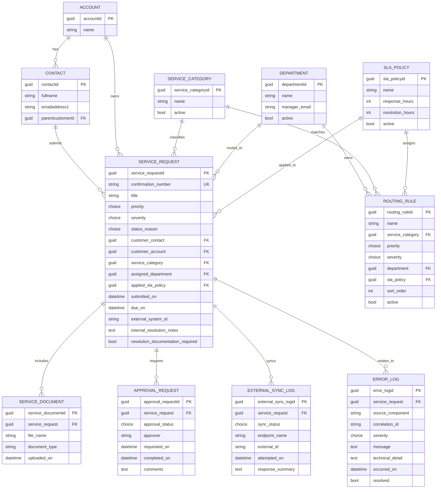

# Reviewer Architecture Plan

This document is the planning baseline for reviewer-facing documentation only. It does not define secrets, tenant-specific values, passwords, endpoint tokens, or implementation code.

## README Structure

The final project README should let a reviewer understand the solution before opening the managed solution or source folders.

1. **Executive Summary**
   - One-paragraph purpose: authenticated external Service Intake built with Power Pages, Dataverse, Power Automate, C# extensibility, and PCF.
   - Short end-to-end flow: portal submission, Dataverse routing, approval, REST sync, internal follow-up, completion guardrail.

2. **Solution Contents**
   - Managed solution zip name: `Enterprise_ServiceIntake_<YourName>.zip`.
   - Unpacked `pac solution unpack` source location.
   - Raw source locations for the C# plugin/custom API and PCF control.
   - Documentation locations: README, ERD, demo script, test evidence checklist.

3. **Architecture Overview**
   - Component diagram or bullet flow covering Power Pages, Dataverse, model-driven app, Power Automate, plugin/custom API, PCF, and external REST endpoint.
   - Clear boundary between low-code, pro-code, and external integration responsibilities.

4. **Data Model and ERD**
   - Dataverse tables, ownership model, key columns, required relationships, and retention/audit considerations.
   - Link to ERD image or Mermaid diagram.

5. **Security and Authentication Strategy**
   - Portal sign-in approach, web roles, table permissions, row-level access, column-level security, and internal model-driven app roles.
   - Explain how external users only see their own requests and how sensitive internal fields remain hidden.

6. **Business Logic Decisions**
   - Confirmation number generation.
   - Routing/SLA rule evaluation.
   - High-priority approval.
   - REST sync and error logging.
   - Critical-request completion validation.
   - For each decision, explain why the selected platform component is the right placement.

7. **Power Pages Experience**
   - Multi-step submission flow.
   - Upload/documentation behavior.
   - Dynamic SLA/routing feedback using Power Pages Web API and/or Liquid.
   - Accessibility and validation notes.

8. **Power Automate Design**
   - Approval trigger, approval condition, REST call, external ID writeback, Try/Catch/Finally scopes, retry policy, and error-log writes.
   - Include what to show if tenant email delivery is restricted: Office 365 Outlook action output, Approval records, and flow run history.

9. **Pro-Code Components**
   - C# plugin/custom API purpose, registration stage, execution mode, target table, exception behavior, and trace logging.
   - PCF control purpose, target form field, UX benefit, accessibility, and fallback behavior.

10. **ALM and Packaging**
    - Publisher/prefix naming.
    - Managed solution export.
    - Unpacked solution source workflow.
    - Environment variables and connection references without secret values.
    - Import assumptions and post-import setup steps.

11. **Demo Script**
    - Link to the demo script outline.
    - Include expected reviewer questions and prepared tradeoff answers.

12. **Test Evidence**
    - Link to evidence checklist.
    - Include screenshots/run history list expected in final submission.

13. **Known Limitations and Assumptions**
    - Trial/developer environment limits.
    - Mock REST endpoint limitations.
    - Email delivery fallback.
    - Scope intentionally kept lean for take-home timing.

## Architecture Decisions

| Area | Decision | Rationale | Reviewer Talking Point |
| --- | --- | --- | --- |
| Core system of record | Dataverse stores service requests, routing rules, documents, approvals, sync state, and error logs. | Dataverse gives relational modeling, security roles, auditing, solution packaging, and first-class Power Platform integration. | The design keeps operational state auditable and deployable as a managed solution. |
| Portal authentication | Use authenticated Power Pages users mapped to Contact rows. Anonymous create was considered because the FAQ allows it, but it is not used in this implementation. | Authentication supports secure login, row-level request visibility, drafts, `My requests`, and request-specific file ownership. | External users see only requests tied to their contact/account through table permissions. |
| Confirmation number | Generate a formatted number server-side at create time. | Server-side generation avoids client tampering and keeps portal, app, and integration entries consistent. | The number can combine an auto number, prefix, and date-friendly display format. |
| Routing/SLA evaluation | Store routing and SLA rules in configurable Dataverse tables. Evaluate on create/update through a plugin or custom API. | Business users can update rules without redeploying code, while server-side evaluation keeps results consistent. | This is better than hard-coded flow conditions because rule data remains maintainable. |
| Dynamic portal feedback | Use Power Pages Web API or Liquid-backed data to preview expected department/SLA before final submit. | The portal requirement asks for real-time feedback without full page reload. | Preview is advisory; final routing still runs server-side for integrity. |
| Approval process | Power Automate handles high-priority manager approval. | Approvals, notifications, run history, retries, and connection references fit Flow well. | If email is unavailable, reviewer evidence comes from approval records and run history. |
| REST sync | Power Automate posts approved requests to a mock REST API and writes the returned external ID to Dataverse. | Flow is appropriate for integration orchestration and has visible operational history. | Try/Catch scopes and error-log rows show enterprise resiliency. |
| Completion guardrail | C# plugin enforces that critical requests cannot be resolved or completed without required resolution documentation. | This is a transactional integrity rule and must not be bypassed by UI or flow changes. | Plugin placement protects all entry points, including model-driven app command buttons, API, and automation. |
| Internal UX | PCF control enhances internal coordinator triage, such as severity visualization or status indicator. | PCF demonstrates pro-code UI skill while keeping business logic server-side. | The PCF improves speed and clarity without becoming a rules engine. |
| Internal dashboard access | Model-driven dashboards are role-gated by dashboard DisplayConditions and sitemap links protected through role-specific access-marker privileges. | Dashboard form security alone did not prevent automatically listed app dashboards from appearing to other roles, so the navigation is also gated. | Coordinators see Operations plus Monitoring; approval managers see Approval plus Monitoring. |
| Error logging | Custom Dataverse error log table captures flow/plugin/integration failures. | Centralized logs simplify support and provide demo evidence. | Logs include source component, correlation/request ID, severity, message, and related request. |

## Proposed ERD

## Entity and Relationship Notes

| Table | Purpose | Key Relationships | Security Notes |
| --- | --- | --- | --- |
| Service Request | Main intake record and lifecycle state. | Contact, Account, Category, Department, SLA Policy, documents, approvals, sync logs, error logs. | External users get self-owned/requester-scoped read/write on allowed fields only. |
| Routing Rule | Configurable rules for department and SLA assignment. | Category, Department, SLA Policy. | Internal admin/configurator only. |
| SLA Policy | Defines response and resolution targets. | Referenced by routing rules and applied to service requests. | Readable to internal staff; portal can expose limited preview data. |
| Service Request Evidence Review | Internal review metadata for SharePoint files that become official evidence, including evidence type, review status, file URL, verifier, and notes. Binary files stay in native SharePoint document management after the Service Request exists. | Many evidence-review rows can reference one service request; each row stores a SharePoint file reference rather than the file content. | Internal manager/coordinator only. Portal users upload files through the native Documents page and do not create evidence-review rows directly. |
| Approval Request | Tracks high-priority approval state and evidence. | One service request can have one or more approvals. | Internal manager/coordinator only. |
| External Sync Log | Records outbound REST sync attempts and returned IDs. | Many attempts per service request. | Internal support only. |
| Error Log | Centralized operational error capture. | Optional related service request. | Internal support/admin only; no secrets or raw credentials in messages. |
| Dashboard Access Marker Tables | Internal access-control marker tables used only by the model-driven sitemap. | Coordinator and manager marker tables are referenced by sitemap privileges. | Service Coordinator has read access to the coordinator marker; Approval Manager has read access to the manager marker. This keeps role-specific dashboard links out of the wrong user's app navigation. |

## Demo Script Outline

1. **Open with architecture**
   - Show the README architecture overview and ERD.
   - State the design principle: Dataverse for authoritative state, Power Pages for external intake, Flow for approval/integration orchestration, plugin for transactional guardrails, PCF for internal UX.

2. **External submitter journey**
   - Sign in as a test portal user.
   - Start a multi-step service request.
   - Enter category, severity, priority, and supporting details.
   - Show dynamic SLA/routing preview updating without full page reload.
   - Upload supporting documentation.
   - Submit and capture the formatted confirmation number.

3. **Security proof**
   - Show the submitted request in the portal.
   - Switch to another portal test user and show that the first user's request is not visible.
   - Mention table permissions, Contact relationship, and hidden internal fields.

4. **Internal coordinator experience**
   - Open the model-driven app.
   - Locate the new request by confirmation number.
   - Show assigned department/SLA fields and PCF control.
   - Explain which fields are internal-only.

5. **Approval and sync path**
   - Change or use a high-priority request that triggers approval.
   - Show approval record or flow run history.
   - Approve the request.
   - Show REST sync action, returned external ID, and Dataverse writeback.

6. **Resiliency path**
   - Demonstrate or show evidence for a forced REST failure.
   - Show Try/Catch behavior in the flow.
   - Open the related Error Log row with source component, correlation ID, and summary.

7. **Completion guardrail**
   - Confirm `Lifecycle Status` is read-only on the coordinator form.
   - Attempt to use `Complete Request` on a critical request without required resolution documentation.
   - Show the plugin/custom API blocks the operation.
   - Add sufficient resolution documentation and complete successfully.

8. **ALM and source review**
   - Show managed solution zip.
   - Show unpacked solution source.
   - Show raw plugin and PCF source folders.
   - Explain connection references/environment variables without exposing secrets.

## Test Evidence Checklist

Use this list to collect reviewer evidence before packaging.

### Portal and Security

- [ ] Screenshot: portal sign-in or documented anonymous fallback.
- [ ] Screenshot: multi-step intake page.
- [ ] Screenshot: dynamic SLA/routing preview before submission.
- [ ] Screenshot: upload/documentation step.
- [ ] Screenshot: confirmation number after submit.
- [ ] Evidence: portal user A can see their own request.
- [ ] Evidence: portal user B cannot see user A's request.
- [ ] Evidence: internal-only fields are not shown on portal pages.

### Dataverse and Model-Driven App

- [ ] Screenshot: Service Request main form with confirmation number.
- [ ] Screenshot: assigned department and applied SLA.
- [ ] Screenshot: PCF control on coordinator form.
- [ ] Screenshot: routing rule and SLA policy configuration records.
- [ ] Evidence: field/table security role notes for external, coordinator, manager, and admin personas.

### Power Automate

- [ ] Screenshot: high-priority approval flow overview.
- [ ] Screenshot: Try/Catch/Finally scope structure.
- [ ] Screenshot: approval record or approval action outcome.
- [ ] Screenshot: successful REST POST run action.
- [ ] Screenshot: external ID written back to Service Request.
- [ ] Screenshot: failed REST or approval run writing to Error Log.

### C# Plugin or Custom API

- [ ] Screenshot or exported registration: target table/message/stage/mode.
- [ ] Evidence: critical completion without documentation is blocked.
- [ ] Evidence: critical completion with sufficient documentation succeeds.
- [ ] Evidence: plugin trace or error handling avoids exposing secrets.

### ALM and Packaging

- [ ] Managed solution zip exists with expected package name.
- [ ] Unpacked solution source exists and can be reviewed.
- [ ] Raw PCF source exists.
- [ ] Raw plugin/custom API source exists.
- [ ] Environment variables and connection references are documented without secret values.
- [ ] Import/setup notes are documented.

## Open Planning Questions

These should be resolved before final README publication:

- Portal authentication decision: authenticated Contact-based access is implemented. Anonymous create remains a possible fallback for constrained tenants, but it is not used in this submission.
- Will routing run as a plugin on Service Request create/update, or as a Custom API called by the portal and plugin-backed final save?
- Which PCF control gives the strongest demo value in the available time: severity selector, SLA/status indicator, or custom timeline?
- Will uploaded documentation use Dataverse file columns, notes, or Power Pages-supported attachment behavior?
- What mock REST endpoint will be used, and what response field will be mapped as `external_system_id`?
- What exact personas/test accounts will be documented without including passwords?
